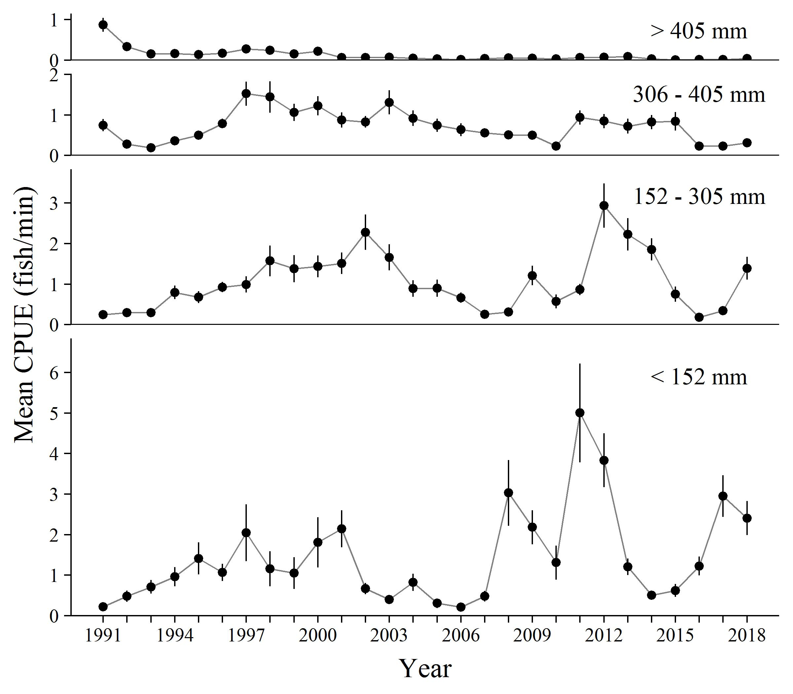

```{r setup, include=FALSE}
knitr::opts_chunk$set(fig.width=5, fig.height=4, fig.retina=3,
                      message=FALSE, warning=FALSE, cache = TRUE, 
                      autodep = TRUE, hiline=TRUE)
knitr::opts_hooks$set(fig.callout = function(options) {
  if (options$fig.callout) {
    options$echo <- FALSE
    options$out.height <- "99%"
    options$fig.width <- 16
    options$fig.height <- 8
  }
  options
})
hook_source <- knitr::knit_hooks$get('source')
knitr::knit_hooks$set(source = function(x, options) {
  if (!is.null(options$hiline) && options$hiline) {
    x <- stringr::str_replace(x, "^ ?(.+)\\s?#<<", "*\\1")
  }
  hook_source(x, options)
})
options(htmltools.dir.version = FALSE, width = 90)
as_table <- function(...) knitr::kable(..., format='html', digits = 3)

```


```{r xaringan-themer, include = FALSE}
library(xaringanthemer)
style_mono_accent(base_color = "#43418A")
 # base_color = "#576bb5"#,
 # inverse_background_color = "#48566e",
#  code_inline_color = "#b97d58",
 # code_font_size = "0.7em",
 # padding = "1em 2em 1em 2em", 
 # text_font_size = "30px",

```

```{r load_packages_and_data, include=FALSE}
library(tidyverse)
library(lattice)
library(palmerpenguins)

#override the pretty xaringanthemer adjustments to ggplot default theme
theme_xaringan_restore_defaults()
```
#Why Code your plots?
- Integrate analysis and figure creation

--
- Reproducible

--
- Free and open source

--
- Excellent documentation

--
- Protects us from ourselves


---
#R Graphics Packages

- base graphics
- `lattice`
- `ggplot2`
- other packages too
---
# base

```{r base_example_plot}
plot(body_mass_g ~ flipper_length_mm, data = penguins)
```
---
## `lattice`

```{r lattice_example_plot}
library(lattice)
xyplot(body_mass_g ~ flipper_length_mm|species, data = penguins)
```

---
## `ggplot2`
```{r echo=FALSE}
theme_set(theme_grey(base_size = 20))
```

```{r ggplot_example_plot}
library(ggplot2)
ggplot(penguins, aes(x = body_mass_g, y = flipper_length_mm)) +
  geom_point()
```

???

The defaults always look bad.

But you can customize plots.

---

```{r echo=FALSE, out.width = "60%", fig.align='center'}
 
```

---

```{r echo=FALSE, out.width = "80%", fig.align='center'}
knitr::include_graphics("./graphics_slides_files/example_figs/pres_RBT_condition_1999_2018.jpg") 
```

---
```{r echo=FALSE, out.width = "90%", fig.align='center'}

```

---
```{r echo=FALSE, out.width = "60%", fig.align='center'}
knitr::include_graphics("./graphics_slides_files/example_figs/recaptures_growth.png")
```

---
```{r echo=FALSE, out.width = "80%", fig.align='center'}
knitr::include_graphics("./graphics_slides_files/example_figs/monthly_angler_use_2016_2018.jpg")
```

---
```{r echo=FALSE, out.width = "68%", fig.align='center'}
knitr::include_graphics("./graphics_slides_files/example_figs/whitefish_movement.PNG")
```

---
class: inverse
#Formatting data

1. All data in one dataframe

--

2. Data in long format  
    - Each observation is a row
    - Each variable is a column
    
--

3. Column classes correct

--

4. Factors ordered correctly

---
#All data in one dataframe
###Add observations (rows)
```{r eval=FALSE}
#base
#columns must match
df.all <- rbind(df1, df2)

#dplyr (tidyverse)
#can handle missing columns
library(dplyr)
df.all <- bind_rows(df1, df2)
```

---
#All data in one dataframe
###Add variables (columns)
```{r eval=FALSE}
#base
df.new <- merge(df1, df2, by = "siteID") #inner
df.new <- merge(df1, df2, by = "siteID", all.x = TRUE) #left outer
df.new <- merge(df1, df2, by = "siteID", all.y = TRUE) #right outer
df.new <- merge(df1, df2, by = "siteID", all = TRUE) #outer

#dplyr (tidyverse)
#will automatically join on common column names
#use by = "siteID" to specify join variable
df.new <- df1 %>% inner_join(df2) #inner
df.new <- df1 %>% left_join(df2) #left outer
df.new <- df1 %>% right_join(df2) #right outer
df.new <- df1 %>% full_join(df2) #outer
```


---
.pull-left[
# Wide
```{r echo=FALSE}
d.wide <- tibble(
  date = rep(as.Date('2019-06-23') + c(0,0,0,2,2,2)),
  site = rep(c("a", "b", "c"), 2),
  FMS = rpois(6, 23),
  BHS = rpois(6, 9), 
  HBC = rpois(6, 2) 
)

d.long <- gather(d.wide, #data
                 key = species,  #new key column (i.e., what are groups)
                 value = catch,  #new value column (i.e., what did you measure)
                 -date, -site) #columns that should not be gathered


knitr::kable(d.wide, format = 'html')
```
]

.pull-right[
#Long
```{r echo=FALSE}
knitr::kable(d.long, format = 'html')
```
]

---
##Convert wide to long

```{r wide_long_conversion, eval=FALSE}
#tidyverse
library(tidyr)

data %>% 
  pivot_longer(!site.id, #don't pivot
               names_to = "count", values_to = "species")
```
  
  
  
--

*Other options:  
`datatable::melt()`   


???


d.wide <- tibble(
  date = rep(as.Date('2019-06-23') + c(0,0,0,1,1,1,2,2,2)),
  site = rep(c("a", "b", "c"), 3),
  flannelmouth = rpois(9, 23),
  bluehead = rpois(9, 9), 
  carp = rpois(9, 2) 
)

d.long <- gather(d.wide, #data
                 key = species,  #new key column (i.e., what are groups)
                 value = n_caught,  #new value column (i.e., what did you measure)
                 -date, -site) #columns that should not be gathered


---
###Check column classes
```{r eval=FALSE}
str(penguins) #base r
glimpse(penguins) #tidyverse
```

###Define column classes
```{r eval=FALSE}
df$weight <- as.numeric(df$weight) #base

df <- df %>% mutate(weight = as.numeric(weight)) #dplyr (tidyverse)
  
as.numeric()
as.integer()
as.character()
as.factor()
as.Date() #format should be 2019-04-30
as.POSIXct() #format: 2019-04-30 14:22:00
```

---
#Order Factors

```{r }
#base
penguins$Species <- factor(penguins$species,
                       levels = c("Gentoo", "Chinstrap", "Adelie")) #<<

#dplyr (tidyverse)
penguins <- penguins %>% 
  mutate(species = factor(species, 
                          levels = c("Gentoo", "Chinstrap", "Adelie"))) #<<

levels(penguins$species) #check they are correct now
```

---
class:inverse
#Exercise: Prepare your data for plotting

1. Start an Rstudio project called "graphics_course.rproj"

2. Open a new r script and save within your new rstudio project as "graphics_course_exercises.r"

3. Write code to import your data to R

4. Write code to format data

  - If data you want to plot is in multiple dataframes, bind or join/merge it into one dataframe
  - Convert wide to long if necessary
  - If columns you intend to plot are not correct class, change class
  - If plotting factors, reorder as desired

We'll continue adding to this r script throughout the class.

Remember to annotate!


---
class:inverse
#Making ggplots

---
###`data`
###`aes`
###`geom`
###`stat`
###`coord`
###`scale`
###`facet` 
###`theme` 

---
###`data`
###`aes`thetic mappings map variables to x, y, color, shape, etc.
###`geom`etric objects display data on plot (point, line, boxplot, etc.)

---
layout: true
##A Minimal ggplot
---
```{r echo=FALSE}
theme_set(theme_grey(base_size = 20))
```
.pull-left[
```{r simpleplot_1a, eval=FALSE}
ggplot(penguins) #<<
```
]

.pull-right[
```{r simpleplot_1a-out, ref.label='simpleplot_1a', echo=FALSE, out.width="100%"}
```
]

---

.pull-left[
```{r simpleplot_1b, eval=FALSE}
ggplot(penguins) +
  aes(x = flipper_length_mm, #<<
      y = body_mass_g) #<<
```
]

.pull-right[
```{r simpleplot_1b-out, ref.label='simpleplot_1b', echo=FALSE, out.width="100%"}
```
]

---

.pull-left[
```{r simpleplot_1c, eval=FALSE}
ggplot(penguins) +
  aes(x = flipper_length_mm, 
      y = body_mass_g) +
  geom_point() #<<
```
]

.pull-right[
```{r simpleplot_1c-out, ref.label='simpleplot_1c', echo=FALSE, out.width="100%"}
```
]

---

.pull-left[
```{r simpleplot_1d, eval=FALSE}
ggplot(penguins) +
  aes(x = flipper_length_mm, 
      y = body_mass_g, 
      color = species) + #<<
  geom_point()
```
]

.pull-right[
```{r simpleplot_1d-out, ref.label='simpleplot_1d', echo=FALSE, out.width="100%"}
```
]

---

.pull-left[
```{r simpleplot_1e, eval=FALSE} 
p.miminal <- ggplot(penguins) + #<<
  aes(x = flipper_length_mm, 
      y = body_mass_g,
      color = species) + 
  geom_point()

p.minimal #<<
```
]

.pull-right[
```{r simpleplot_1d-out, ref.label='simpleplot_1d', echo=FALSE, out.width="100%"}
```
]

---
layout: false
class:inverse
#Exercise: Simple ggplot

In "graphics_course_exercises.r"

Make a simple ggplot with your data
  - data
  - map variables to aesthetics
  - use geom to define plot type

---
#Default `theme_gray()`
```{r echo = FALSE, fig.width=8, fig.height=6}
mtcars$gear <- factor(mtcars$gear)
ggplot(mtcars, aes(x = wt, y = mpg, colour = gear)) +
  geom_point()
```

---
```{r echo = FALSE, out.width = "100%", fig.asp = 0.5}
library(cowplot)
mtcars$gear <- factor(mtcars$gear)
p <- ggplot(mtcars, aes(x = wt, y = mpg, colour = gear)) +
  geom_point()

classic <-  p +  theme_classic(base_size = 10) +
  theme(plot.title = element_text(family = "mono")) + 
  ggtitle("theme_classic()")
minimal <- p +  theme_minimal(base_size = 10)+
  theme(plot.title = element_text(family = "mono")) +
  ggtitle("theme_minimal()")
          
bw <- p +  theme_bw(base_size = 10)+
  theme(plot.title = element_text(family = "mono")) + 
  ggtitle("theme_bw()")
light <- p + theme_light(base_size = 10) +
  theme(plot.title = element_text(family = "mono")) +
  ggtitle("theme_light()")

plot_grid(classic,  minimal, bw, light, nrow = 2)

```
[All built in themes](https://ggplot2.tidyverse.org/reference/index.html#section-themes)
---
```{r out.width = "70%", fig.height=3}
theme_set(theme_minimal(base_size = 20)) #<<

ggplot(mtcars, aes(x = wt, y = mpg, color = gear)) +
  geom_point()
```
---
class: inverse
#Exercise: Get rid of ugly defaults!

At the top of your "graphics_course_exercises.r" script:

Use `theme_set()` to set a ggplot theme of your choice
  - include `base_size = ...` to increase font size
  - *optional* include `base_family = ...` if you want a different font ("sans" is default, "serif" and "mono" are other built-in fonts)

Run the code for your plot again - it should look better now!
