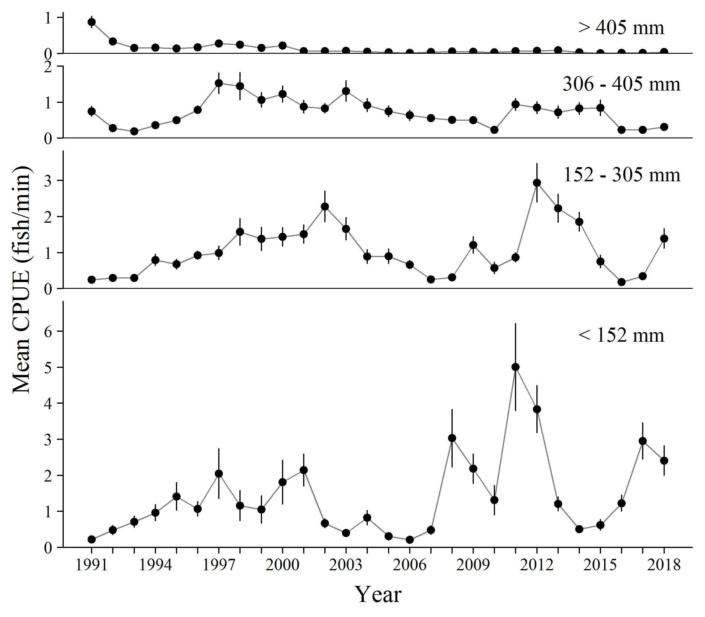
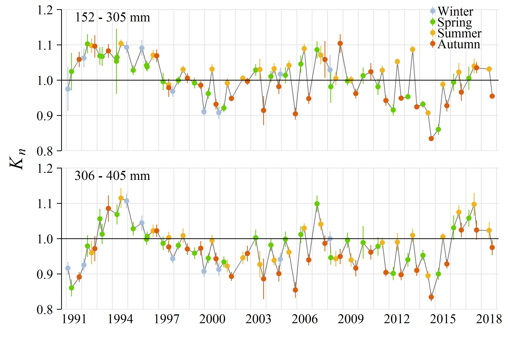

```{r setup, include=FALSE}
knitr::opts_chunk$set(fig.width=5, fig.asp=0.8, fig.retina=3,
                      message=FALSE, warning=FALSE, cache = TRUE, 
                      autodep = TRUE, hiline=TRUE)
knitr::opts_hooks$set(fig.callout = function(options) {
  if (options$fig.callout) {
    options$echo <- FALSE
    options$out.height <- "99%"
    options$fig.width <- 16
    options$fig.height <- 8
  }
  options
})
hook_source <- knitr::knit_hooks$get('source')
knitr::knit_hooks$set(source = function(x, options) {
  if (!is.null(options$hiline) && options$hiline) {
    x <- stringr::str_replace(x, "^ ?(.+)\\s?#<<", "*\\1")
  }
  hook_source(x, options)
})
options(htmltools.dir.version = FALSE, width = 90)
as_table <- function(...) knitr::kable(..., format='html', digits = 3)
```

```{r xaringan-themer, include = FALSE}
library(xaringanthemer)
mono_accent(
  base_color = "#576bb5",
  inverse_background_color = "#48566e",
  code_inline_color = "#b97d58",
  header_font_google = google_font("Roboto Slab", "500", "500i"),
  text_font_google   = google_font("Roboto", "300", "300i"),
  code_font_size = "0.7em",
  padding = "1em 2em 1em 2em", 
  text_font_size = "30px",
)
```

```{r load_packages_and_data, include=FALSE}
library(ggplot2)
library(tidyr)
library(dplyr)
```

###`data`
###`aes`
###`geom`
###`stat`
###`coord`
###`scale`
###`facet` 
###`theme` 

---
layout: true
### A More complex ggplot
---

.left-code[
```{r first-plot1a, eval=FALSE}
ggplot(msleep)
```
]

.right-plot[
```{r first-plot1a-out, ref.label='first-plot1a', echo=FALSE, out.width="100%"}
```
]

---

.left-code[
```{r first-plot1b, eval=FALSE}
ggplot(msleep,
  aes(x = bodywt, #<<
      y = sleep_total)) #<<
```
]

.right-plot[
```{r first-plot1b-out, ref.label='first-plot1b', echo=FALSE, out.width="100%"}
```
]

---

.left-code[
```{r first-plot1c, eval=FALSE}
ggplot(msleep,
  aes(x = bodywt,
      y = sleep_total)) +
  geom_point() #<<
```
]

.right-plot[
```{r first-plot1c-out, ref.label='first-plot1c', echo=FALSE, out.width="100%"}
```
]

---

.left-code[
```{r first-plot1d, eval=FALSE}
ggplot(msleep,
  aes(x = bodywt,
      y = sleep_total)) +
  geom_point() +
  scale_x_log10("Weight (kg)") + #<<
  scale_y_continuous("Hrs Sleep", #<<
    limits = c(0, 20))  #<< 
```
]

.right-plot[
```{r first-plot1d-out, ref.label='first-plot1d', echo=FALSE, out.width="100%"}
```
]

---

.left-code[
```{r first-plot1e, eval=FALSE}
ggplot(msleep,
  aes(x = bodywt,
      y = sleep_total)) +
  geom_point() +
  scale_x_log10("Weight (kg)") +
  scale_y_continuous(
    limits = c(0, 20),
    "Hours Sleep") +
  stat_smooth(method = "lm") #<<
```
]

.right-plot[
```{r first-plot1e-out, ref.label='first-plot1e', echo=FALSE, out.width="100%"}
```
]

---

.left-code[
```{r first-plot1f, eval=FALSE}
ggplot(msleep,
  aes(x = bodywt,
      y = sleep_total)) +
  geom_point() +
  scale_x_log10("Weight (kg)") +
  scale_y_continuous(
    limits = c(0, 20),
    "Hours Sleep") +
  stat_smooth(method = "lm") + 
  facet_wrap(~vore) #<<
```
]

.right-plot[
```{r first-plot1f-out, ref.label='first-plot1f', echo=FALSE, out.width="100%"}
```
]

---


.left-code[
```{r first-plot1f2, eval=FALSE}
ggplot(msleep[!is.na(msleep$vore),],  #<<
  aes(x = bodywt,
      y = sleep_total)) +
  geom_point() +
  scale_x_log10("Weight (kg)") +
  scale_y_continuous(
    limits = c(0, 20),
    "Hours Sleep") +
  stat_smooth(method = "lm") + 
  facet_wrap(~vore) 
```
]

.right-plot[
```{r first-plot1f2-out, ref.label='first-plot1f2', echo=FALSE, out.width="100%"}
```
]

---

.left-code[
```{r first-plot1g, eval=FALSE}
ggplot(msleep[!is.na(msleep$vore),]) + 
  aes(x = bodywt,
      y = sleep_total) +
  geom_point() +
  scale_x_log10("Weight (kg)") +
  scale_y_continuous(
    limits = c(0, 20),
    "Hours Sleep") +
  stat_smooth(method = "lm") + 
  facet_wrap(~vore) +
  theme_minimal(base_family = "serif") #<<
```
]

.right-plot[
```{r first-plot1g-out, ref.label='first-plot1g', echo=FALSE, out.width="100%"}
```
]


---
layout:false
###`data` can be subset or aggregated within plot code
###`aes`
###`geom`
###`stat`
###`coord`
###`scale` 
###`facet` 
###`theme`

???
live coding:

subset in base and tidyverse

summarize/group_by in tidyverse

---
###`data`
###`aes`
###`geom`etric objects display data   
###`stat`istics display transformed or summarized data
###`coord`
###`scale` 
###`facet` 
###`theme`

---

```{r common-plot-types, out.width = "100%", fig.asp = 0.45, echo=FALSE}
require(ggplot2)
gpoint <- ggplot(iris, aes(Sepal.Width, Sepal.Length)) +
  geom_point() +
  scale_y_continuous(expand = expand_scale(mult = c(0.05, .25))) +
  theme_void() 

gline <- ggplot(economics[economics$date >= as.Date("2000-01-01"),],
                aes(date, unemploy)) + 
  geom_line() +
  scale_y_continuous(expand = expand_scale(mult = c(0.05, .25))) +
  theme_void()

gboxplot <- ggplot(iris, aes(Species, Sepal.Length)) +
  geom_boxplot() +
  scale_y_continuous(expand = expand_scale(mult = c(0.05, .25))) +
  theme_void()

d <- data.frame(x = rnorm(500, 0, 1))

ghist <- ggplot(d, aes(x)) +
  geom_histogram() +
  scale_y_continuous(expand = expand_scale(mult = c(0.05, .25))) +
  theme_void()

gbar <- ggplot(mpg, aes(x = drv)) + 
  geom_bar() +
  scale_y_continuous(expand = expand_scale(mult = c(0.05, .25))) +
  theme_void()

df <- data.frame(xvar = 1:6,
  yvar = c(1, 5, 3, 4, 3.5, 4),
  upper = c(1.9, 5.9, 4.3, 4.8, 4.5, 4.5),
  lower = c(0.2, 3.6, 2, 3, 2.2, 3.2))

gpointrange <- ggplot(df, aes(xvar, yvar, ymin = lower, ymax = upper)) +
  geom_pointrange() +
  scale_y_continuous(expand = expand_scale(mult = c(0.05, .25))) +
  theme_void()

graster <- ggplot(faithfuld, aes(x = waiting, y = eruptions)) +
 geom_raster(aes(fill = density)) +
   scale_y_continuous(expand = expand_scale(mult = c(0.05, .25))) +
  theme_void() +
  scale_fill_viridis_c() +
  theme(legend.position = "none")

gdensity <- ggplot(d, aes(x)) +
  geom_density(fill = "gray") +
  scale_y_continuous(expand = expand_scale(mult = c(0.05, .25))) +
  theme_void()

cowplot::plot_grid(gpoint, gline, gboxplot, ghist,
          gbar, gpointrange, gdensity, graster,
          ncol = 4, label_fontfamily = "mono", label_size = 8,
          labels = c("geom_point", "geom_line", "geom_boxplot", "geom_histogram", 
                     "geom_bar", "geom_pointrange", "geom_density", "geom_raster"),
          label_x = 0.05, label_y = 1, hjust = 0, vjust = 1)
```


[All geoms and stats](https://ggplot2.tidyverse.org/reference/index.html#section-layer-geoms)

???

live coding: 

different geoms have different required aes (x, y, only x, ymin, ymax etc.)
usually logical, and documentation with tell you if needed

discrete/continuous: some will take either, others require one type
factor or cut to bin continuous data into discrete

multiple geoms on one plot

---


```{r errorbar_geoms, out.width = "100%", fig.asp = 0.28, echo=FALSE}

df <- data.frame(xvar = 1:4,
  yvar = c(1, 5, 3, 4),
  upper = c(1.9, 5.9, 4.3, 4.8),
  lower = c(0.2, 3.6, 2, 3))

gerror <- ggplot(df, aes(xvar, yvar, ymin = lower, ymax = upper)) +
  geom_errorbar() +
  scale_y_continuous(expand = expand_scale(mult = c(0.05, .25))) +
  theme_void()

gerrorh <- ggplot(df, aes(y = xvar, x = yvar, xmin = lower, xmax = upper)) +
  geom_errorbarh() +
  scale_y_continuous(expand = expand_scale(mult = c(0.05, .25))) +
  theme_void()

glinerange <- ggplot(df, aes(xvar, yvar, ymin = lower, ymax = upper)) +
  geom_linerange() +
  scale_y_continuous(expand = expand_scale(mult = c(0.05, .25))) +
  theme_void()

cowplot::plot_grid(gerror, gerrorh, glinerange,
          ncol = 3, label_fontfamily = "mono", label_size = 8,
          labels = c("geom_errorbar", "geom_errorbarh", "geom_linerange"),
          label_x = 0.05, label_y = 1, hjust = 0, vjust = 1)
```


[All geoms and stats](https://ggplot2.tidyverse.org/reference/index.html#section-layer-geoms)

???

live coding

df <- data.frame(trt = factor(1:3),
  resp = c(1, 5, 3),
  upper = c(1.1, 5.3, 3.3),
  lower = c(0.8, 4.6, 2.4))

ggplot(df, aes(x = trt, y = resp)) +
geom_col() +
geom_errorbar(aes(ymin = lower, ymax = upper),
width = 0.3)

order (reverse order, show how error bars hidden)

---
#Adjust position
```{r position_adjustments, out.width = "40%", fig.asp = 0.7}
ggplot(iris, aes(Species, Sepal.Length)) +
  geom_jitter() 

```


---
#Adjust position

```{r adjust-position, out.width = "100%", fig.asp = 0.28, echo=FALSE}

mpg1 <- mpg[mpg$fl %in% c("p", "r"),]

gdodge <- ggplot(mpg1, aes(x = fl, fill = drv)) + 
  geom_bar(position = "dodge") +
  scale_y_continuous(expand = expand_scale(mult = c(0.05, .25))) +
  theme_void() +
  theme(legend.position = "none")

gstack <- ggplot(mpg1, aes(x = fl, fill = drv)) + 
  geom_bar() +
  scale_y_continuous(expand = expand_scale(mult = c(0.05, .25))) +
  theme_void()  +
  theme(legend.position = "none")

gfill <- ggplot(mpg1, aes(x = fl, fill = drv)) + 
  geom_bar(position = "fill") +
  scale_y_continuous(expand = expand_scale(mult = c(0.05, .25))) +
  theme_void()  +
  theme(legend.position = "none")

cowplot::plot_grid(gdodge, gstack, gfill,
          ncol = 3, label_fontfamily = "mono", label_size = 8,
          labels = c("dodge", "stack", "fill"),
          label_x = 0.05, label_y = 1, hjust = 0, vjust = 1)
```


???

live coding4

jitter for points `geom_jitter(width = 0.25, height = 1)`
caution: best for exploratory, NOT final plots

dodge - useful for bar/col and boxplot
`ggplot(mtcars, aes(factor(cyl), fill = factor(vs))) +`
  `geom_bar(position = position_dodge())`

`position_dodge(preserve = "single")`
if using errorbars, must dodge those too and define width!
`p + geom_linerange(`
  `aes(ymin = y - 1, ymax = y + 1),`
  `position = position_dodge(width = 0.9))`

stack: stacks bars. good for comparing numbers


fill: like stack, but makes each bar same height 
good for comparing proportions

---

#stat: summarized data

```{r}
ggplot(mpg, aes(displ, hwy)) +
  geom_point() +
  stat_smooth()
```

[All geoms and stats](https://ggplot2.tidyverse.org/reference/index.html#section-layer-geoms)
???
options

`stat_smooth(method = "lm", se = "false")`

loess, gam, lm


---
class: inverse
#Exercise: plot your data
Use one or more of the geoms and stats we learned about to start a plot you want to make with your data

It's ok to start several plots

Make all plots objects in your r environment
`my.plot <- ggplot(data, aes(...`  
`my.plot`

Don't worry if they are ugly or still missing features, we will continue working on these figures as we learn more 

---
###`data`
###`aes`thetic mappings map variables to x, y, color, shape, etc.
###`geom`
###`stat`
###`coord`
###`scale` 
###`facet` 
###`theme`
---

```{r common-aesthetics, out.width = "100%", fig.asp = 0.45, echo=FALSE}
require(ggplot2)
aes_pos <- cowplot::ggdraw() + 
  geom_segment(data = data.frame(x = c(0, 0.5),
                                 xend = c(1, 0.5),
                                 y = c(0.5, 0.1),
                                 yend = c(0.5, 0.9)),
                aes(x = x, y = y, xend = xend, yend = yend),
                arrow = arrow(length = grid::unit(12, "pt")), 
               size = .75) +
  cowplot::draw_text("y", .5, 1, size = 18, vjust = 1, hjust = 2) +
  cowplot::draw_text("x", 1, .5, size = 18, vjust = 1.5, hjust = 1) + 
  coord_cartesian(xlim = c(-.2, 1.2), ylim = c(-.2, 1.2))

aes_color <- cowplot::ggdraw() +
  geom_tile(data = data.frame(x = 0.15 + .2333*(0:3)), 
            fill = "gray80", size = 1,
            aes(x, y = .5, color = factor(x)), 
            width = .2, height = .6) +
  scale_color_manual(values = c("#a75c2e", "#4c6a3e", 
                               "#576885", "#624c33"))

aes_fill <- cowplot::ggdraw() +
  geom_tile(data = data.frame(x = 0.15 + .2333*(0:3)), 
            color = "black", size = 1,
            aes(x, y = .5, fill = factor(x)), 
            width = .2, height = .6) +
  scale_fill_manual(values = c("#a75c2e", "#4c6a3e", 
                               "#576885", "#624c33"))

aes_shape <- cowplot::ggdraw() +
  geom_point(data = data.frame(x = (.5 + 0:3)/4),
             aes(x, y = .5, shape = factor(x)), size = 8, fill = "grey80") +
  scale_shape_manual(values = 21:24)

aes_alpha <- cowplot::ggdraw() +
  geom_point(data = data.frame(x = (.5 + 0:3)/4),
             aes(x, y = .5, alpha = factor(x)), shape = 19, size = 8) +
  scale_alpha_manual(values = c(0.25, 0.5, 0.75, 1))

aes_size <- cowplot::ggdraw() +
  geom_point(data = data.frame(x = (.5 + 0:3)/4),
             aes(x, y = .65, size = factor(x)), shape = 21, 
             fill = "grey80") +
  geom_segment(data = data.frame(x = c(0, 0.23, 0.48, 0.73),
                                 xend = c(0.23, 0.48, 0.73, 0.98)),
                aes(x = x, y = 0.1, xend = xend, yend = 0.4, 
                    size = factor(x))) +
  scale_size_manual(values = c(1, 2, 2, 4, 3, 7, 4, 10))

aes_group <- cowplot::ggdraw() +
  geom_segment(data = data.frame(x = rep(0.05, 4),
                                 xend = rep(0.95, 4),
                                 y = (1.5 + 0:3)/6,
                                 yend = (1.5 + 0:3)/6),
               aes(x = x, y = y, xend = xend, yend = yend), size = 1) +
  scale_size_identity()

aes_ltp <- cowplot::ggdraw() +
  geom_segment(data = data.frame(x = rep(0.05, 4),
                                 xend = rep(0.95, 4),
                                 y = (1.5 + 0:3)/6,
                                 yend = (1.5 + 0:3)/6,
                                 linetype = 4:1),
               aes(x = x, y = y, xend = xend, yend = yend, linetype = linetype), size = 1) +
  scale_linetype_identity()

cowplot::plot_grid(aes_pos, aes_shape, aes_size, aes_alpha,
          aes_color, aes_fill, aes_ltp, aes_group,
          ncol = 4, label_fontfamily = "mono",
          labels = c("position", "shape", "size", "alpha", "color", "fill", "linetype", "group"),
          label_x = 0.05, label_y = 0.98, hjust = 0, vjust = 1)
```

[all aesthetics](https://ggplot2.tidyverse.org/articles/ggplot2-specs.html)

???
Live coding

Basic use

color vs. fill
names or hex codes

group vs. others)color, linetype (ChickWeight
ggplot(ChickWeight, 
       aes(x = Time, y = weight,
           group = Chick)) + #<<
         geom_line()

aes() can go in ggplot() or geom_...()
Put in ggplot if you want to apply to all geoms, geom if one geom

---
###Change appearance...
.pull-left[
###of entire geom
```{r out.width = "99%", fig.asp=0.55}
ggplot(mpg, 
       aes(x = displ, y = cty)) + 
geom_point(color = "blue") #<<

```
]

.pull-right[
###based on variable
```{r out.width = "99%", fig.asp=0.5}
ggplot(mpg, 
       aes(x = displ, y = cty,  #<<
           color = drv)) + #<<
geom_point()
```
]

???

We'll get to changing colors in scale section

Live coding 

inside vs. outside aes is COMMON ERROR

show errors if you do this wrong

---
class: inverse
#Exercise: `aes()` aesthetic modifications

Use what we learned about `aes` to modify your graph

- make at least on variable-based aesthetics change
- at least one aesthetics change that changes the appearance of an entire geom (i.e., not based on a variable)

Copy/paste your last plot, and give new name

---
###`data`
###`aes`
###`geom`
###`stat`
###`coord`inates define coordinate system
###`scale` defines axes
###`facet` 
###`theme`

---
graph with customized scales (log and custom color scale, legend)

---
#coordinate systems

`coord_cartesian()` 

`coord_fixed()`  
`coord_polar()`  
`coord_map()`  

???
Usually don't need to specify, R can figure this out

Use Coord for limits - does not crop data!

live coding: use coord for xlim and ylim

---
#Axis scales

- continous `scale_x_continous()`
- log transformed `scale_y_log10()`
- square root transform `scale_x_sqrt()` 

- discrete `scale_y_discrete()`

- date/datetime `scale_x_date()`, `scale_x_datetime()`

???

Live coding:
can put limits in here, BUT, it crops data (demonstrate)


Limits, axis breaks, axis labels

---
#Axis Expansion

```{r}
ggplot(mpg, aes(fl, fill = drv)) + 
  geom_bar()
```

---
#Axis Expansion
```{r}
ggplot(mpg, aes(fl, fill = drv)) + 
  geom_bar() +
  coord_cartesian(expand = FALSE) #<<
```

---
#Axis Expansion

```{r}
ggplot(mpg, aes(fl, fill = drv)) + 
  geom_bar() +
  coord_cartesian(expand = FALSE,
                  ylim = c(0, 190)) #<<
```

---
#Axis Expansion

```{r}
ggplot(mpg, aes(fl, fill = drv)) + 
  geom_bar() +
 scale_y_continuous(expand = expand_scale(mult = c(0, 0.1))) #<<

```

---
#Color, shape, linetype scales

```{r}
require(RColorBrewer)

ggplot(iris, aes(x = Sepal.Length, y = Sepal.Width)) +
  geom_point(aes(color = Species, shape = Species)) +
  scale_colour_brewer(palette = "Set1") + #<<
  scale_shape_manual(values = c(15, 16, 17)) #<<

```

[all scales](https://ggplot2.tidyverse.org/reference/index.html#section-scales)

???

Manual palettes
google search to find values
n must match!

good color: brewer, viridis
fun: wesanderson

color: continuous vs. discrete

continuous color: two color vs. diverging vs. n-color
setting NA value
setting midpoint (diverging)
---
#Changing legend text

```{r}
ggplot(PlantGrowth, aes(x = group, y = weight, fill = group)) + 
  geom_boxplot()
```
---
#Changing legend text

```{r}
ggplot(PlantGrowth, aes(x = group, y = weight, fill = group)) + 
  geom_boxplot() +
  scale_fill_discrete(name = "Treatment", #<<
                      labels = c("Control", "Treatment 1", "Treatment 2")) #<<
```

???

Just like how scale is where you change axis labels, color etc. is a scale too - so you change legend titles in scale_...()
---
class: inverse
#Exercise: work with `scale` and `coord`

For each task, copy/paste code from a previous plot and give it a new name

1. Breaks and limits: Make a plot with customized axis breaks, custom axis limits, and no axis expansion
2. Transformations: Apply a log or square root transformation
3. Aesthetic scales and legends: Change the color, shape, or linetype scale in a plot (use the plot you made in the `aes` exercise as a starting point), and change the legend text.
4. Dates and datetimes: Graph date or datetime data, and set date_breaks to your desired interval (week, day, year, etc.) *If you don't have date/datetime data, the built in dataset `economics` is a good practice timeseries.*

---
###`data`
###`aes`
###`geom`
###`stat`
###`coord`
###`scale` 
###`facet` splits into multiple plots
###`theme`

---
layout: true
### `facet_wrap()`
---

.left-code[
```{r facetwrap_1a, eval=FALSE}
ggplot(mpg, aes(displ, hwy)) + 
  geom_point() +
  facet_wrap(~class) #<<
```
]

.right-plot[
```{r facetwrap_1a-out, ref.label='facetwrap_1a', echo=FALSE, out.width="100%"}
```
]

---

.left-code[
```{r facetwrap_2b, eval=FALSE}
ggplot(mpg, aes(displ, hwy)) + 
  geom_point() +
  facet_wrap(~class, 
             scales = "free") #<<
```
]

.right-plot[
```{r facetwrap_2b, ref.label='facetwrap_2b', echo=FALSE, out.width="100%"}
```
]

---

.left-code[
```{r facetwrap_3c, eval=FALSE}
ggplot(mpg, aes(displ, hwy)) + 
  geom_point() +
  facet_wrap(~class, nrow = 2) #<<
  #or ncol instead of nrow
```
]

.right-plot[
```{r facetwrap_3c, ref.label='facetwrap_3c', echo=FALSE, out.width="100%"}
```
]

---
layout: true
### `facet_grid()`
---

.left-code[
```{r facetgrid_1, eval=FALSE}
ggplot(mpg, aes(displ, hwy)) + 
  geom_point() +
  facet_grid(drv~cyl) #<<
```
]

.right-plot[
```{r facetgrid_1-out, ref.label='facetgrid_1', echo=FALSE, out.width="100%"}
```
]

---

.left-code[
```{r facetgrid_2, eval=FALSE}
ggplot(mpg, aes(displ, hwy)) + 
  geom_point() +
  facet_grid(drv~cyl, 
             scales = "free") #<<
```
]

.right-plot[
```{r facetgrid_2-out, ref.label='facetgrid_2', echo=FALSE, out.width="100%"}
```
]

---

.left-code[
```{r facetgrid_3, eval=FALSE}
ggplot(mpg, aes(displ, hwy)) + 
  geom_point() +
  facet_grid(drv~cyl, 
             scales = "free", 
             space = "free") #<<
```
]

.right-plot[
```{r facetgrid_3-out, ref.label='facetgrid_3', echo=FALSE, out.width="100%"}
```
]

---

.left-code[
```{r facetgrid_4, eval=FALSE}
ggplot(mpg, aes(displ, hwy)) + 
  geom_point() +
  facet_grid(drv~cyl, 
             scales = "free_x", #<<
             space = "free_x") #<<
```
]

.right-plot[
```{r facetgrid_4-out, ref.label='facetgrid_4', echo=FALSE, out.width="100%"}
```
]

---

.left-code[
```{r facetgrid_5, eval=FALSE}
ggplot(mpg, aes(displ, hwy)) + 
  geom_point() +
  facet_grid(.~cyl, #<<
             scales = "free_x", 
             space = "free_x") 
```
]

.right-plot[
```{r facetgrid_5-out, ref.label='facetgrid_5', echo=FALSE, out.width="100%"}
```
]

---
layout: false
class: inverse
#Exercise: Facet a plot
try with defaults, `scales = free`, and `space = free` to see how plots change

---
###`data`
###`aes`
###`geom`
###`stat`
###`coord`
###`scale` 
###`facet` 
###`theme` alters appearance and formatting

---

```{r echo=FALSE, out.width = "60%", fig.align='center'}
 
```

---

```{r echo=FALSE, out.width = "80%", fig.align='center'}
 
```

???

This is how, during your defense, you get your committee member who hates R figures to compliment you on the pretty figures he thinks you made in sigmaplot

---
```{r echo = FALSE, out.width = "100%", fig.asp = 0.5}

mtcars$gear <- factor(mtcars$gear)
p <- ggplot(mtcars, aes(x = wt, y = mpg, colour = gear)) +
  geom_point()

classic <-  p +  theme_classic(base_size = 10) +
  theme(plot.title = element_text(family = "mono")) + 
  ggtitle("theme_classic()")
minimal <- p +  theme_minimal(base_size = 10)+
  theme(plot.title = element_text(family = "mono")) +
  ggtitle("theme_minimal()")
          
bw <- p +  theme_bw(base_size = 10)+
  theme(plot.title = element_text(family = "mono")) + 
  ggtitle("theme_bw()")
light <- p + theme_light(base_size = 10) +
  theme(plot.title = element_text(family = "mono")) +
  ggtitle("theme_light()")

cowplot::plot_grid(classic,  minimal, bw, light, nrow = 2)

```
[All built in themes](https://ggplot2.tidyverse.org/reference/index.html#section-themes) [Extensions for more themes](https://www.ggplot2-exts.org/gallery/)

???
quickly make pretty nice plots

Can adjust base_size and base_family

---
#`theme()` adjust individual theme elements
```{r eval=FALSE}
+ theme(panel_background = element_rect(color = "red"), #<<
        axis.title.x = element_text(size = 16, color = "blue"), #<<
        legend_position = c(0.9, 0.9))
```

--

`element_rect()`  
`element_line()`  
`element_text()`  
`element_blank()` 
---
#`theme()` adjust individual theme elements
```{r eval=FALSE}
+ theme(panel_background = element_rect(color = "red"),
        axis.title.x = element_text(size = 16, color = "blue"),
        legend_position = c(0.9, 0.9)) #<<
```


`element_rect()`  
`element_line()`  
`element_text()`  
`element_blank()`  

???

Live coding: add various ones to plot

---
#My favorite theme edits
```{r eval=FALSE}
legend_position = c(0.9, 0.9) #position within plot
legend_position = "bottom" #top, right, left, none
legend_title = element_blank() #remove legend title
panel_background = element_rect(fill = NA) #transparent plot background
plot_background = element_rect(fill = NA) #tranparent background
strip_background = element_blank() #remove strip background on facets
panel_spacing = unit(1, "lines") #change spacing between facets
```

[all `theme()` edits](https://ggplot2.tidyverse.org/reference/theme.html)

---
class: inverse
#Exercise: theme edits

--
#Contest!

##Prettiest plot and Ugliest plot

---

#`+` combines layers

#layers are plotted in order listed

---
#More than one way

```{r eval=FALSE}
ggplot(mtcars, aes(x = hp, y = mpg, color = factor(cyl))) +
  geom_point()

ggplot(mtcars) +
  aes(x = hp, y = mpg, color = factor(cyl)) +
  geom_point()

ggplot(mtcars) +
  geom_point(aes(x = hp, y = mpg, color = factor(cyl)))

mtcars %>% 
  ggplot(aes(x = hp, y = mpg, color = factor(cyl))) +
  geom_point()

```
add graph in second column
---
#More than one way

```{r eval=FALSE}
ggplot(mtcars, aes(x = hp, y = mpg, color = factor(cyl))) + #<<
  geom_point() #<<

ggplot(mtcars) +
  aes(x = hp, y = mpg, color = factor(cyl)) +
  geom_point()

ggplot(mtcars) +
  geom_point(aes(x = hp, y = mpg, color = factor(cyl)))

mtcars %>% #<<
  ggplot(aes(x = hp, y = mpg, color = factor(cyl))) + #<<
  geom_point() #<<

```
add graph in second column
---
#Saving

#`ggsave()`

```{r eval=FALSE}
ggsave(myplot, 
       "./output/figures/test_plot.png", 
       dpi = 300, width = 6, height = 4) 
```

`"eps", "ps", "tex", "pdf", "jpeg", "tiff", "png", "bmp", "svg", "wmf"`
---

#Common Errors

- missing/extra `( ) , +`  

--
- `$` notation in plot code  

--
- scale/data mismatch  

--
- Using data from multiple dataframes  

--
- Multiple `geom_...()` instead of `aes(group = ...)`  

--
- stuff that should be inside `aes()` isn't, or vice versa  

---
class:inverse
#Exercise: Publication or Presentation ready plot
Use your data, and what we just learned, to make a plot and save it. 

Lots of the work you did to practice individual plot changes can be combined to make the plot you want.


