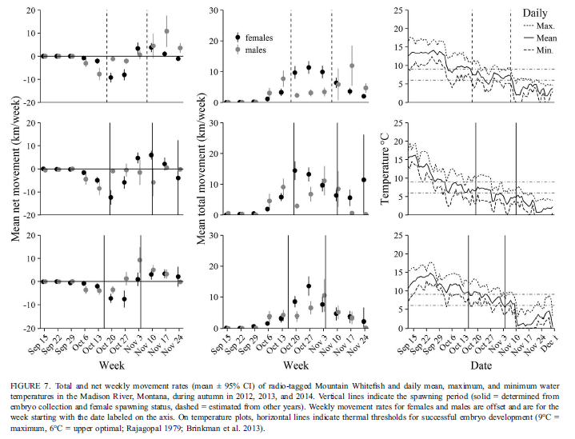
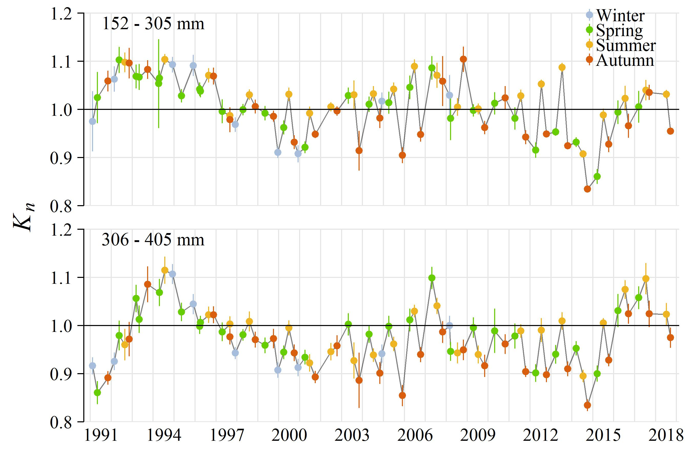

```{r setup, include=FALSE}
knitr::opts_chunk$set(fig.width=5, fig.height=4, fig.retina=3,
                      message=FALSE, warning=FALSE, cache = TRUE, 
                      autodep = TRUE, hiline=TRUE)
knitr::opts_hooks$set(fig.callout = function(options) {
  if (options$fig.callout) {
    options$echo <- FALSE
    options$out.height <- "99%"
    options$fig.width <- 16
    options$fig.height <- 8
  }
  options
})
hook_source <- knitr::knit_hooks$get('source')
knitr::knit_hooks$set(source = function(x, options) {
  if (!is.null(options$hiline) && options$hiline) {
    x <- stringr::str_replace(x, "^ ?(.+)\\s?#<<", "*\\1")
  }
  hook_source(x, options)
})
options(htmltools.dir.version = FALSE, width = 90)
as_table <- function(...) knitr::kable(..., format='html', digits = 3)

```


```{r xaringan-themer, include = FALSE}
library(xaringanthemer)
mono_accent(
  base_color = "#576bb5",
  inverse_background_color = "#48566e",
  code_inline_color = "#b97d58",
  header_font_google = google_font("Roboto Slab", "500", "500i"),
  text_font_google   = google_font("Roboto", "300", "300i"),
  code_font_size = "0.7em",
  padding = "1em 2em 1em 2em", 
  text_font_size = "30px",
)
```

```{r load_packages_and_data, include=FALSE}
library(ggplot2)
library(tidyr)
library(dplyr)
```

```{r echo=FALSE, out.width = "68%", fig.align='center'}

```
---
background-image: url(https://i.pinimg.com/736x/aa/95/9d/aa959d6be07333834c540a138fecada9--line-chart-data-visualization.jpg)
background-size:contain
---

class:inverse
#Annotation
##`paste()`

##`expression()`

##`geom_...()` (annotation geoms)

---
```{r echo=FALSE, out.width = "80%", fig.align='center'}
 
```

---

```{r echo=FALSE, out.width = "60%", fig.align='center'}

```

---
class:inverse
#Exercise: annotation

Add fancy text and annotation to your plot. Try to add
1. axis title with symbols, subscript, or similar
2. annotate shapes, lines, or text within plot panel
3. add statistics annotation (model line, equation, or similar)

---
class:inverse
#Secondary axes

##`sec.axis()`
##`dup.axis()`

---
```{r echo=FALSE, out.width = "50%", fig.align='center'}
 
```

---
class: inverse
#Complex Layouts
##Multipanel and inset graphs
##`install.packages(cowplot)`

##`plot_grid()`
##`ggdraw()`

---
```{r echo=FALSE, out.width = "60%", fig.align='center'}
knitr::include_graphics("./graphics_slides_files/example_figs/recaptures_growth.png")
```
---
```{r echo=FALSE, out.width = "80%", fig.align='center'}

```
---
class:inverse
#Exercise

Multipanel and inset graphs

Combine several of your graphs to make a
1. multipanel graph
2. inset graph

---
class:inverse
#Facets revisited: 
##useful for hacks and workarounds

---
```{r echo=FALSE, out.width = "70%", fig.align='center'}
knitr::include_graphics("./graphics_slides_files/example_figs/percent_native.jpg")
```

---
class: inverse
#Themes revisited

- theme packages

- writing/modifying your own theme

---
background-image: url(https://raw.githubusercontent.com/hrbrmstr/hrbrthemes/master/man/figures/README-sc-1.png)
background-size: contain
---
```{r echo=FALSE, out.width = "70%", fig.align='center'}
 
```

---
class:inverse
#Exercise

Make a custom theme

1. Pick your favorite ggplot theme, and copy/paste its code from the ggplot2 github page into a new r script
2. Modify several features of the theme to customize it 
3. Save in a separate r script `custom_theme_function.r`
4. use `source("./functions/custom_theme_function.r")` to load your theme and use it in a plot!

---
class: inverse
#Automating plot creation:

#`for` loops

---
background-image:url("graphics_slides_files/ggplot_extensions.PNG")
#[Extensions](http://www.ggplot2-exts.org/gallery/)

---
class:inverse
#Exercise: Finalize your plots
